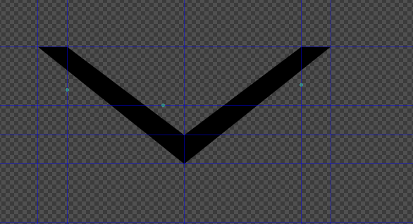

# Animated Chevron Creation
## Drawing the Chevrons
___
Inorder to create the chevrons quickly I used Inkscape though you could use 
Illustrator or a vector graphics app of your choice. Just make sure whichever app
you choose it is able to export a plain SVG.

First create a blank document and added in some guides along the x-axis at 70 mm, 75 mm,
100 mm, 120 mm and 125 mm. I then added guides along the y-axis at 100 mm, 110 mm, 115 mm,
120 mm, 130 mm, 140 mm, 142 mm, and 145 mm.


Use the Guideline dialog to make this easier to place the guides on exact points.\

If you are using Inkscape here is some documentation on guidelines
[Working with Guides in Inkscape](https://inkscapetutorials.wordpress.com/2014/04/25/working-with-guides-in-inkscape/). 

The center box created by the guides is where we will be drawing our chevrons.
Using the free hand tool draw lines that connect (70, 100) to (75, 100) and (75, 100)
to (100, 115). From (100, 115) to (120, 100) and (120, 100) to (125, 100). Then 
from (125, 100) to (100, 120) and (100, 120) finally back to (70, 100). 

You should end up with something like this.\


Next we want it to be filled in with no outline. We set the stoke paint to none and 
set fill to black(#000000ff).\


We then want to 


## Cleaning up the SVG file
```svg
<path
    id="path1017"
    style="fill:#000000;fill-opacity:1;stroke:none;stroke-width:0.264583px;stroke-linecap:butt;stroke-linejoin:miter;stroke-opacity:1"
    d="M 9.7305117e-5,9.5249999e-5 25.000121,19.999909 50.000147,9.5249999e-5 45.000025,0 25.000121,15.076178 4.9997936,9.5249999e-5 Z" />
<path
    id="path1017-1"
    style="fill:#000000;fill-opacity:1;stroke:none;stroke-width:0.264583px;stroke-linecap:butt;stroke-linejoin:miter;stroke-opacity:1"
    d="M 0,10.00018 25.000026,30 l 25.00002,-19.99982 -5.00012,-9e-5 -19.9999,15.07617 -20.00033,-15.07608 z" />
<path
    id="path1017-1-1"
    style="fill:#000000;fill-opacity:1;stroke:none;stroke-width:0.264583px;stroke-linecap:butt;stroke-linejoin:miter;stroke-opacity:1"
    d="M 6e-6,20.00018 25.000026,40 l 25.00002,-19.99982 -5.00011,-9e-5 -19.99991,15.07617 -20.00032,-15.07608 z" />
<rect
    style="fill:#000000;fill-opacity:1;stroke:none;stroke-width:1.4"
    id="rect2202"
    width="50"
    height="3"
    x="2.6e-05"
    y="42" />
```
```svg
<path
  id="TopChevron"
  style="fill:#000000;fill-opacity:1;stroke:none;stroke-width:0.264583px;stroke-linecap:butt;stroke-linejoin:miter;stroke-opacity:1"
  d="M 9.7305117e-5,9.5249999e-5 25.000121,19.999909 50.000147,9.5249999e-5 45.000025,0 25.000121,15.076178 4.9997936,9.5249999e-5 Z" />
<path
  id="MiddleChevron"
  style="fill:#000000;fill-opacity:1;stroke:none;stroke-width:0.264583px;stroke-linecap:butt;stroke-linejoin:miter;stroke-opacity:1"
  d="M 0,10 25,30 l 25,-20 -5.00012,-9e-5 -19.9999,15.07617 -20.00033,-15.07608 z" />
<path
  id="BottomChevron"
  style="fill:#000000;fill-opacity:1;stroke:none;stroke-width:0.264583px;stroke-linecap:butt;stroke-linejoin:miter;stroke-opacity:1"
  d="M 6e-6,20.00018 25.000026,40 l 25.00002,-19.99982 -5.00011,-9e-5 -19.99991,15.07617 -20.00032,-15.07608 z" />
<rect
  style="fill:#000000;fill-opacity:1;stroke:none;stroke-width:1.4"
  id="UnderLine"
  width="50"
  height="3"
  x="0"
  y="42" />
```
## Animating the SVG


<iframe
src="https://codepen.io/sean_r/codepen/embed/preview/bGYjzEr"
style="width:100%; height:300px;"></iframe>
